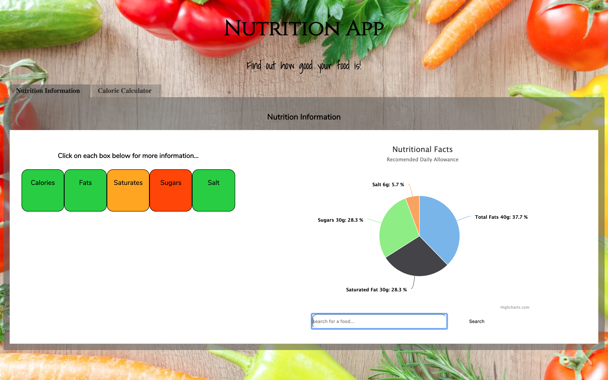
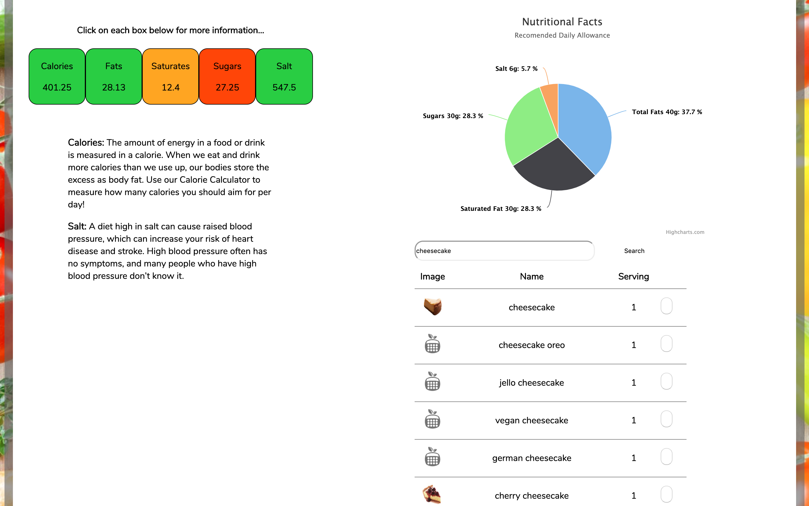

# NewTrition

### An educational app created to help educate people of all ages on nutrition and to discover the key nutrient levels contained within their food using the Nutritionix Api (https://www.nutritionix.com/business/api), Vue, JavaScript, Express and  Highcharts.



## Our Brief

### MVP:
A user should be able to…

- View nutritional content.
- Be able to interact with the page to move through different sections of content.

### Extensions:
- To Use an API to bring in content or a database to store information.
- Use charts or external components to display information dynamically to the page.

## Installation After Pulling from GitHub

### In Server Directory:
Before the program will work you will need to install the following packages:

- node-fetch: ```npm install node-fetch --save```
- dotenv: ```npm install dotenv```
- parser: ```npm install body-parser```
- cors: ```npm install cors```
- express: ```npm install express```
- nodemon: ```npm i --save-dev nodemon```

You will also have to create a .env in the group_project_js folder containing the api key and api id, as per the following:

```
API_KEY=
API_ID=
```

To run the server, run the script below in your terminal whilst in the server directory:

- run nodemon script: ```npm run server:dev```

### In Client Directory:
Before the program will work you will need to install the following packages:

- node modules: ```npm install```
- tiny-tabs: ```npm install --save vue-tiny-tabs```
- highcharts: ```npm install --save highcharts```
- slider: ```npm install --save vue-custom-range-slider```

To run the client, run the script below in your terminal whilst in the client directory:

- ```npm run serve```

## How it works and what it does:

- Within the nutrition information tab of the app you can see your recommended daily amount of nutrients breakdown within the pie chart. Underneath this you can search for any type of food using the search bar. 


- When you have found the food you are looking for you can select it using the button to the right. The quantities of nutrients within your selected food will appear within the nutrient tabs to the left. You can also click on the name of each nutrient within the tab to find a little more information on each nutrient. If you click on the name again the information will disappear. These tabs are designed to look similar to the nutrition labels that are found on food packaging. The aim is to help people understand what the labels mean and how it relates to their daily intake.



- Within the calorie calculator tab you can input your details to receieve the recommended daily amount of calories you should consume in order to maintain your current weight. The aim is to assist the user in understanding how many calories they should be consuming, which will hopefully help and inform food choices.


